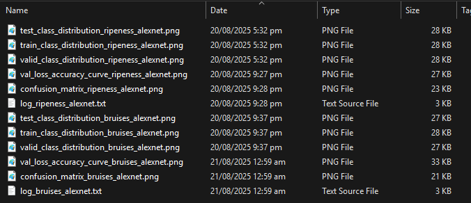

# TRAINING AND TESTING DATASET
- python code for making the .pth CNN model (EfficientNet B0 by default)
## Steps
0) Download the image dataset refer [here](https://drive.google.com/drive/folders/1tLUeG6NLy-yfO8jMLsA9KxOyEoKQxMbM?usp=sharing)
1) Split the image dataset refer [here](https://github.com/kenaniscoding/thesis-dataset-split)
2) Clone this repository and check the `changeme` at `train_bruises.py` and `train_ripeness.py`
3) Run the command in CLI 
- for the bruises
```bash
python train_bruises.py
```
- for the ripeness
```bash
python train_ripeness.py
```
## Other Remarks
- output graphs are in .png
- output CLIs are in .txt
- variable `epoch=1` is default at `main()`
- img dataset path is set to be the same directory as the .py as seen on the `.gitignore`
## Timestamp for AlexNet
